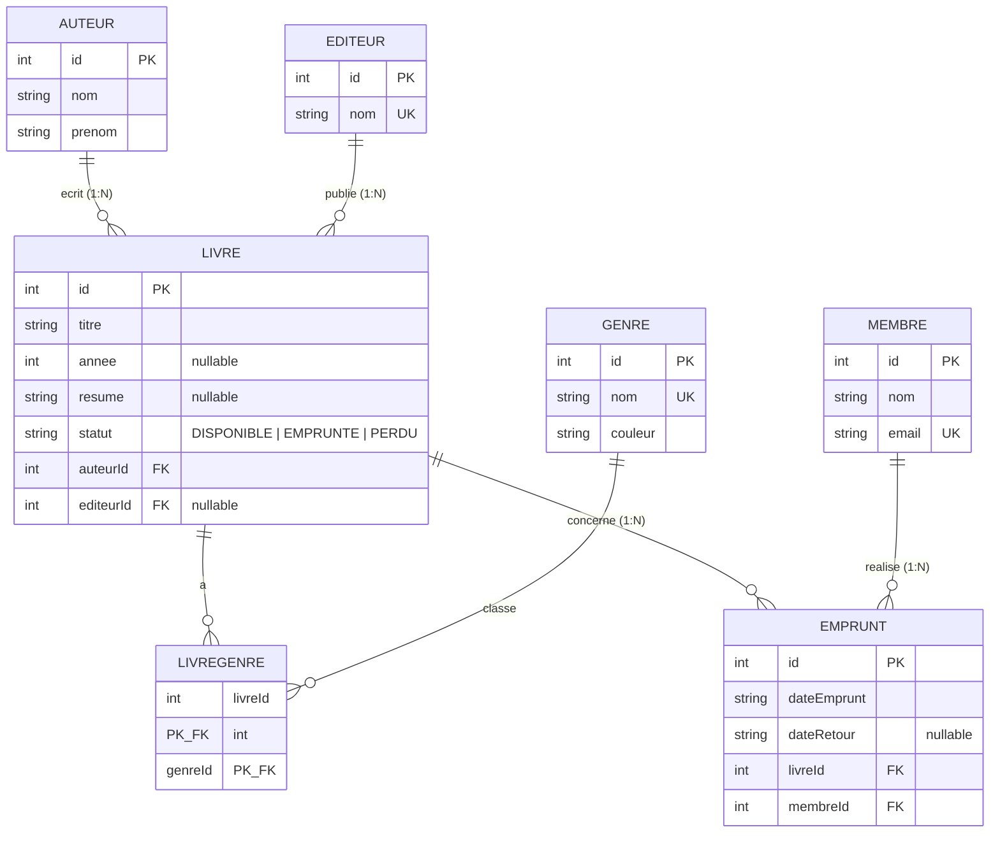

# Schema de la base de donnees

Base **SQLite** modelisee avec **Prisma** (`prisma/schema.prisma`). 7 modeles.

Un fichier draw.io est egalement disponible : [`schema.drawio`](schema.drawio)
(ouvrable avec l'extension *Draw.io Integration* dans VS Code).

## Diagramme entite-association (Mermaid)

## Relations

| Relation | Cardinalite | Mecanisme | ON DELETE |
|---|---|---|---|
| Auteur -> Livre | 1:N | FK `auteurId` dans `Livre` | `CASCADE` |
| Editeur -> Livre | 1:N | FK `editeurId` (nullable) dans `Livre` | `SET NULL` |
| Livre <-> Genre | **N:M** | table de jonction `LivreGenre`, PK `(livreId, genreId)` | `CASCADE` |
| Membre -> Emprunt | 1:N | FK `membreId` dans `Emprunt` | `CASCADE` |
| Livre -> Emprunt | 1:N | FK `livreId` dans `Emprunt` | `CASCADE` |

## Notes de modelisation

- Toutes les cles primaires sont `INTEGER PRIMARY KEY AUTOINCREMENT`.
- Les dates (`dateEmprunt`, `dateRetour`) sont stockees en **TEXT au format ISO 8601**
  (SQLite n'a pas de type DATE natif).
- Le `statut` du livre est limite aux valeurs autorisees par une contrainte **`CHECK`**
  ajoutee a la main dans la migration (Prisma ne genere pas les contraintes CHECK).
- Champs optionnels (nullable) : `Livre.annee`, `Livre.resume`, `Livre.editeurId`,
  `Emprunt.dateRetour`.
